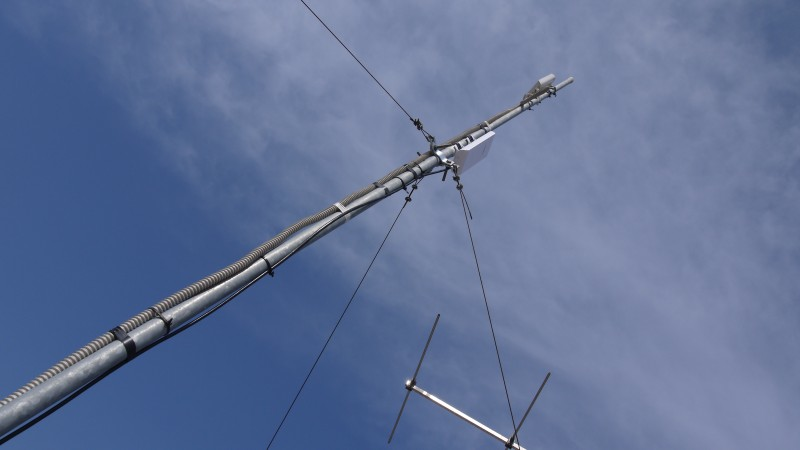
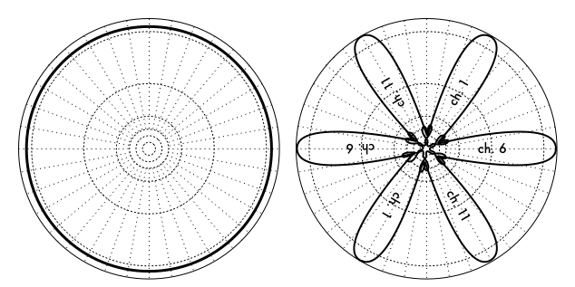
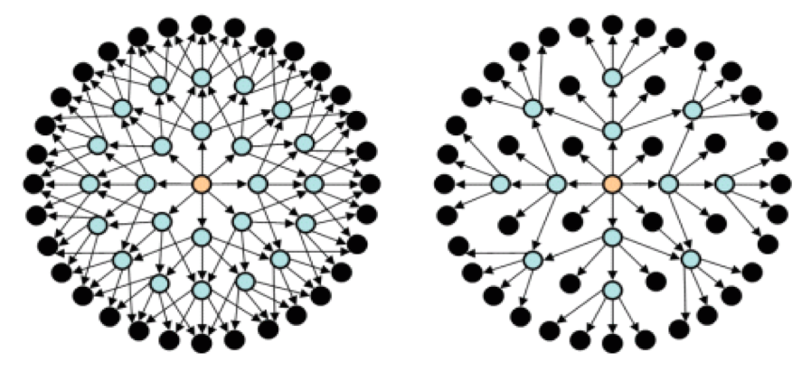
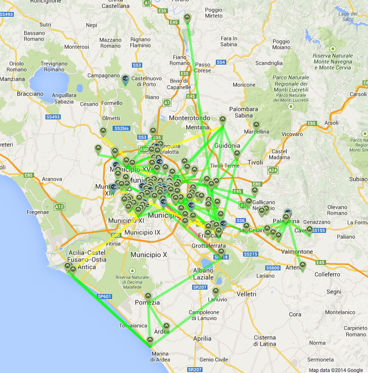
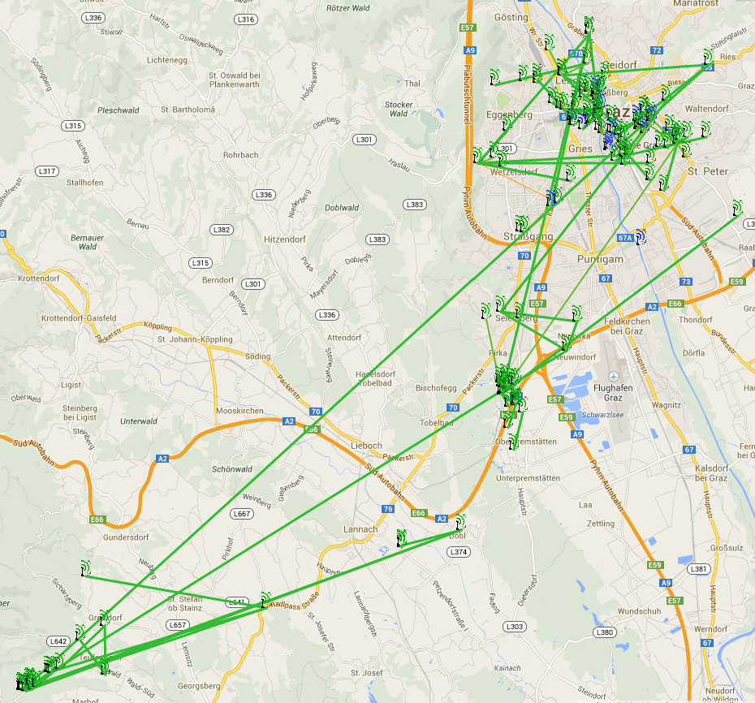
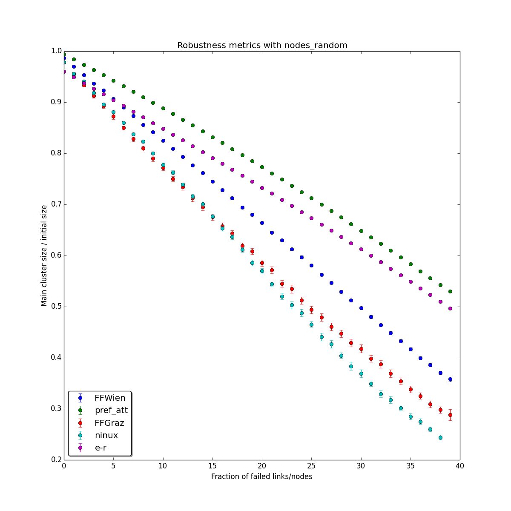
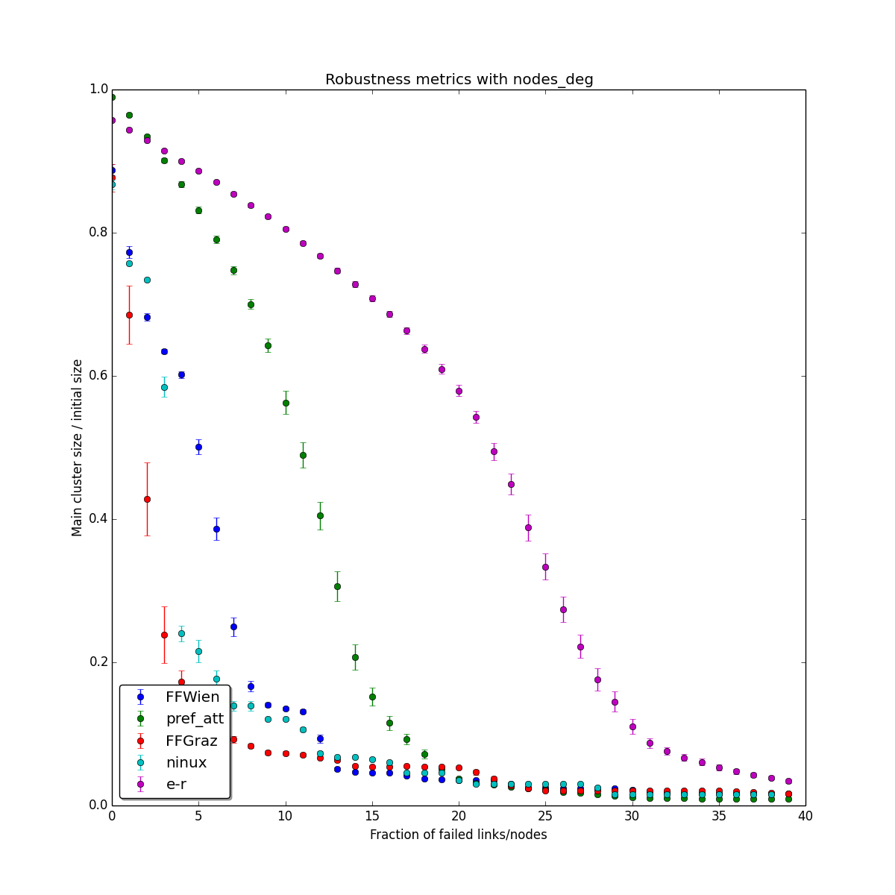
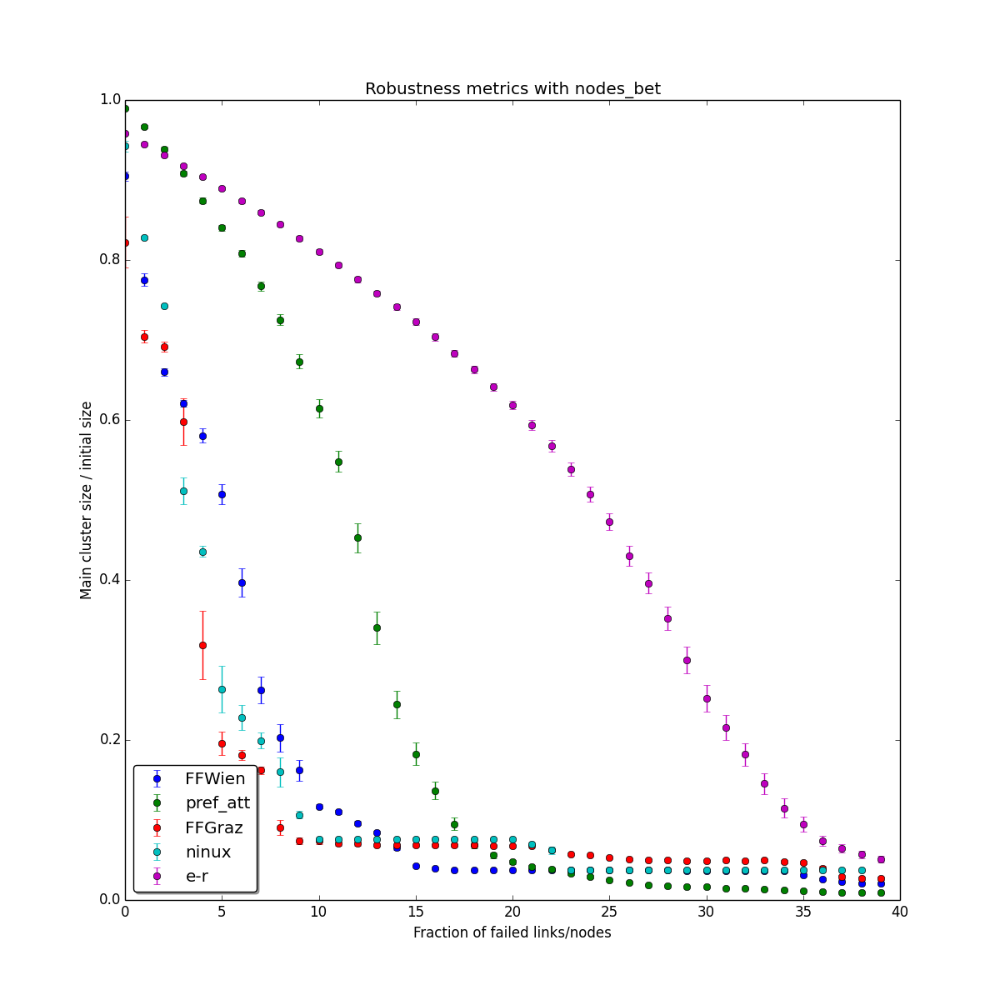

---
title: Advanced Topology Analysis in Three Wireless Community Networks
author: Michele Pittoni
date: 2014 - VI
bibliography: thesis.bib
...

\newcommand{\st}{\text{ st. }}
\newcommand{\etx}{\mathrm{ETX}}
\newcommand{\linkq}{\mathrm{LQ}}
\newcommand{\nlq}{\mathrm{NLQ}}
\newcommand{\mpr}{\mathrm{MPR}}
\chapterstyle{section}

# Introduction {-}
Wireless Community Networks (WCNs), a particular kind of wireless mesh networks, have become more and more popular in recent years. These networks are different from traditional ones in various aspects, such as the link nature and the arising topologies. For this reason, generic network protocols may not be well suited for WCNs and much research effort is being dedicated to the development of new routing protocols for this networks and for measuring their efficiency.

This works provides an introduction to the topic of Wireless Community Networks and a description of the three networks which are subsequently analysed. Also provided is an introduction to OLSR, the routing protocol which is used in the analysed networks. The biggest part focuses on the analysis of some efficiency metrics for the chosen networks and a comparison with some well known random network models.

# Wireless Community Networks
The phrase "Wireless Community Network" has been used in literature to indicate various kinds of projects. The most common usage refers to wireless mesh networks operated by a community of citizens, as opposed to those controlled by a single entity (corporation or government). Other authors also use the term for the public hotspot networks run by municipalities, or more generally for networks that provide wireless connection to the public. In this document the term is used with the first meaning, only for networks which are run -- not merely accessible -- by the community.

## History
The appearence of the first Wireless Community Networks can be dated to the late 1990s-early 2000s, when the IEEE 802.11 protocol (WiFi) was first introduced. They started as experiments by radio enthusiasts who wanted to explore the potential of this new technology, pushing it to the limit: WiFi was designed as a protocol for local communication, but it was shown that, with the right equipment, it can perform well also on long distance links. The experimentation was made easier by the unlicensed spectrum of frequencies in which WiFi operates.

With WiFi gaining popularity and wireless enabled devices becomnig mainstream, the cost of WiFi equipment decreased and so did the barrier to participate in WCNs. At the same time, wireless protocols evolved and improved -- for example 802.11a worked in the less crowded 5GHz band, allowing more separation between the used frequencies and thus less interference. In addition, a key factor to the diffusion on WCNs was the scarce availability of broadband connections in certain areas. In such cases, networks were not an experiment anymore, but were used to provide services where commercial initiatives were lacking.

Today, the WCN scenario is varied: in some places they are used to mitigate the digital divide, elsewhere they remaind experimental testbeds or are more focused on the social/political aspect of being an autonomous network owned and run by citizens. In the latter, the focus is on the services provided inside the network rather than on Internet access, even if it may be available. Some WCNs have grown to the point of having an Autonomous System (AS) number assigned and being able to peer with other networks at Internet eXchange Points (IXPs).

WCNs usually have a cultural background of Open Source enthusiasts and hackers^[as in "curious", not as in "criminal"] in general. Some of them are run by a formal associations, other by informal groups of citizens, but in every case node owners know each other and there is a sense of community. More experienced participants share their technical knowledge (and their time), making it possible for new members to enter the network with minimum effort.

Because of their nature of not asking permissions, it is difficult to determine precisely the number of active WCNs as there is no central registry to look at. However, there is a Wikipedia page^[@_list_2014] which, albeit incomplete, lists 262 WCNs at the time of writing. The dimensions of such networks are varied, from just a handful of nodes to nearly 25,000 as in Guifi^[<http://guifi.net>], which is widely regarded as the world's largest WCN.

## Technology



WCNs were born together with the IEEE 802.11 protocol family and continue to use it for various reasons, such as hardware availability and low cost, unlicensed frequency spectrum operation and the constant improvement of subsequent versions. Other solutions for the pyhsical layer are sometimes used -- for example proprietary protocols, maybe operating in licensed frequencies, or even methods not based on radio^[Ronja, <http://ronja.twibright.com/>] -- but they are an uncommon last resort when WiFi can not work (due to interference or other reasons).

A node of a WCN is a router connected with one or more radio interfaces. There is not a standard for the construction of a node, but over time every community has gathered some best practices and guidelines based on experience and trial-and-error. The equipment used varies from consumer WiFi routers (such as the very popular Linksys WRT54GL) with homemade antennas, to professional and more expensive equipment dedicated to long-range WiFi links. Smaller nodes, especially if they are near enough to other ones, may use a single omnidirectional antenna to connect to different nodes. Usually, however, directional antennas with a limited beam width are used, to reduce interference leveraging different channels, avoid receiving noise from all directions and achieve an higher gain. Some nodes use both kinds of antennas, directional for backbone links and omnidirectional to provides an hotspot access.



Routing is one of the biggest challenges in wireless mesh networks. Due to the very nature of wireless links, traditional routing protocols thought for wired networks perform poorly when applied to them. In recent years, many new routing protocols have been proposed to address this issue and today there is a competition with no clear winner. The two most widely known routing protocols for wireless mesh and ad-hoc networks are OLSR and BATMAN. The former, which is used in the three WCNs analysed in this work, will be the subject of chapter 3. *some words on BATMAN?*

# Network topology and graphs
Some mathematical instruments are required to do any kind of description or analysis of the topology of a network, or to explain the functioning of a routing protocol.

The mathematical structure which is used to describe networks is the graph. A *simple, undirected graph* is an ordered pair $G = (V, E)$, where elements of $V$ are the *nodes* (also called *vertices*) of the graph and are usually denoted with letters $u,v,w,\ldots$, while $E \subseteq \binom{V}{2}$ is the set of the *edges* of the graph. For convenience, $e_{ij} \coloneqq \{v_i, v_j\} \in E$.

An edge $e_{ij}$<!--_--> is said to be *incident* to the vertices $v_i$ and $v_j$; equivalently, $v_i$ and $v_j$ are incident to $e_{ij}$<!--_-->. Two vertices incident to the same edge are said *adjacent*.

The graph is said simple since there are no loops (i.e. $\{u,u\} \not\in E$) and each pair of vertices is connected by at most one edge. The above mentioned graph is also said undirected. On the other hand, a *directed graph* is a pair $D = (V, A)$ where $A = \{(u,v) | u,v \in V,\, u \neq v\}$ -- the elements of $A$ are usually called *arcs*.

For the purposes of describing networks, graphs are considered to be *finite*, so $N$ and $E$ are finite sets. Many well known finite graph properties do not hold in the infinite case.

A *weighted graph* is a graph in which every edge has an associated label *weight*, usually a real number. It is useful to define a function $w: E \rightarrow \mathbb{R}$ which associates weights to edges; in the case of unweighted graphs, it can be assumed $w: e \mapsto 1\, \forall e \in E$.

To model networks as graphs, each node of the network is represented by a node in the graph and a link between two nodes is represented by an edge between those nodes. If there are unidirectional link, a directed graph is used. For the purposes of this work, every link is considered bidirectional and symmetric, so from now on "graph" will be use for simple, undirected graphs.

## Terminology

### Order and size
The *order* of a graph is the number of its nodes, $|V|$.
The *size* of a graph is the number of its edges, $|E|$.

### Degree
The *degree* $k_v$ of a vertex $v$ is the number of edges incident to that vertex. A vertex of degree 0 is an *isolated vertex*. A vertex of degree 1 is a *leaf*.

The *total degree* of a graph is $\sum_{v \in V} k_v$.

The *degree sequence* of a graph is the list of degrees in non-increasing order. Not every non-increasing sequence of integers is the degree sequence of some graph.

The *degree distribution* of a graph is a function $p_k: \mathbb{N} \rightarrow [0, 1]$ such that

\begin{equation*}
p_k(n) = \frac{\left\vert{ \{v \in V \st k_v = n\} }\right\vert}{|V|}
\end{equation*}

The degree distribution is a discrete probability distribution since $\sum_{k} p_k = 1$.

### Subgraphs
A *subgraph* $G' = (V', E')$ of $G$ is a graph such that $V' \subseteq V$ and $E' \subseteq E\restriction_{V'}$, where $E\restriction_{V'} = \{\{v_i, v_j\} \in E \st v_i,v_j \in V'\}$.

### Walks, paths
A *walk* is a sequence of vertices $P = (v_0, v_1, \ldots, v_n) \in V \times V \times \ldots \times V$ such that $e_ij \in E,\, 0 \leq i < n$. A walk is *closed* if $v_0 = v_n$, *open* otherwise. The *length* of the walk is $n$. The *weight* of the walk is $w_P = \sum_0^{n-1} w(e_ij)$. In unweighted graphs, $w_P = N$.

A *path* is a walk with no repeated vertices. A *cycle* is a closed walk with no repeated vertices, except obviously the starting one which is repeated once at the end.

Given a graph with no negative-weight cycles, a *geodesic path*, also called *shortest path*, between $v_0$ and $v_n$ is a walk $P = (v_0, v_1, \ldots, v_n)$ such that $\nexists P' = (u_0, u_1, \ldots, u_m)$ with $u_0 = v_0,\, u_m = v_n \st w_{P'} < w_P$. Note that $P$ is a path: if $\exists v_i, v_j \in P \st v_i = v_j$, then $\exists P' = (v_0, \ldots, v_i, v_{j+1}, \ldots, v_n) \st w_{P'} < w_P \Rightarrow P$ is not the geodesic path.\
In a graph with negative-weight cycles, the geodesic path is not defined, since it is possible to have walks with $w_P = -\infty$.\
The length of a geodesic path (which is the length of all of them) from $u$ to $v$ is called *geodesic distance* of $u$ and $v$, indicated with $d_{uv}$<!--_-->

### Neighbours
Each vertex adjacent to $v$ is also called a *neighbour* of $v$. The set of the neighbours of $v$ is called *neighbourhood* of $v$.

The concept of neighbourhood may be extended to vertices at any distance. For example, the *2-hop neighbourhood* of $v$ is the set of vertices $u$ such that there is a walk from $v$ to $u$ whit lenght 2. Similarly, the *strict 2-hop neighbourhood* of $v$ is the set of vertices which are in the 2-hop neighbourhood, excluding $v$ itself and its direct neighbours.

### Connectivity
A graph is called *connected* if, for each pair $\{u,v\}$ of nodes, there is a path between $u$ and $v$.

A *connected component* of $G$ is a maximally connected subgraph of $G$.

### Centrality
In network science there is substantial interest in the concept of the centrality of a vertex (or an edge) in a graph. The idea behind this metric is to determine the most "important" components of a network. The meaning of "important" varies depending on the context: in social networks importance is usually defined by the influence of a node, measured by the size of it neighbourhood. In communication networks, the most important nodes are those who participates most communications, either by forming circuits or by relaying packets. These are just two examples of different notions of importance that require different ways to be measures. In the following paragraphs, the centrality metrics relevant to this work are presented.

#### Degree centrality
The degree of a vertex is the simplest possible measure of centrality and it is the only one that is only based on local properties. This is an advantage from the computational point of view, but it also implies that degree centrality is the least significant centrality metric. Nonetheless, depending on the graph, it can approximate quite well the behaviour of other metrics.

\begin{equation}
C_D(v) = k_v
\end{equation}

#### Betweenness centrality
Betweenness centrality of vertex $v$ is defined as the fraction of shortest paths between any two vertices that pass through $v$. Formally, define $\sigma(s,t)$ the number of shortest paths from $s$ to $t$ and $\sigma(s,t|v)$ the number of those paths that pass through $v$. If $s = t,\, \sigma(s,t) = 1$. There is not a consensus in literature if a path "passes through" its endpoint; in this case, it is assumed not: $\sigma(s,t|s) = \sigma(s,t|t) = 0$. The betweennes centrality is

\begin{equation}
C_B(v) = \sum_{s,t \in V} \frac{\sigma(s,t|v)}{\sigma(s,t)} %_
\end{equation}

Betweennes centrality is especially useful in the study of communication networks because information usually travels through the shortest path, so $C_B$ helps estimating how much traffic a node will see, in a way other centrality measures do not consider. For example, in the classic Barbell graph -- two complete graphs connected by a path -- vertices on the path have a very small degree but since every path between the two complete graphs passes through them they have high betweenness. This reflects the big control they have over the communications between other nodes.

#### Edge betweenness centrality
The concept of betweenness centrality can also be easily extended to edges, with a similar notation.

\begin{equation}
C_{E}(e) = \sum_{s,t \in V} \frac{\sigma(s,t|e)}{\sigma(s,t)}
\end{equation}

#### Closeness centrality
Closeness centrality is also based on shortest paths, but has a different approach and a different meaning. It is based on the mean distance between $v$ and the other vertices. If $d_{vu}$<!--_--> is the geodesic distance between $v$ and $u$, the *mean geodesic distance* from $v$ to $u$, averaged over all vertices $u$ is

\begin{equation}
\mathcal{L}_v = \frac{1}{n} \sum_u d_{vu}  %_
\end{equation}

Since usually centrality measures have high values for more central nodes, closeness centrality is usually defined as the inverse of the mean distance $\mathcal{L}_v$.

\begin{equation}
C_C(v) = \frac{1}{\mathcal{L}_v} = \frac{n}{\sum_u d_{vu}}  %_
\end{equation}

Closeness centrality, despite being often used in network studies, has come shortcomings. For example, the above definition is only valid if the graph is connected, since $d_{vu}$ is defined to be infinite if there is no path from $v$ to $u$. In graphs with more than one connected components, $C_C$ would then be zero for every vertex. The usual solution is to compute the closeness centrality for each connected component separately: this works, but since distances are usually smaller in small components, vertices in those components tend to have higher closeness centrality, which may be undesirable.

Another issue with closeness centrality is that its values are often cramped in a small range from lowest to highest. In most networks distances tend to be small, typically increasing with the logarithm of the size $n$ of the graph. So, the lower and upper bound for $\mathcal{L}_v$<!--_--> are, respectively, $1$ and $\log n$. Similarly, the range for $C_C$ is limited.

## Random graph models
A random graph is a graph generated by a random process. The reason for using random graph models in network analysis is that they can produce graphs with known degree distributions, which can be used to prove mathematically or otherwise analyse empirically their structural and dynamical properties.

### Erd\H{o}s-Rényi random graph
The random graph model originally proposed by Erd\H{o}s and Rényi is also called $G(n,M)$ model, since it consists in the uniform random selection of a graph from the set of all graphs with $n$ nodes and $M$ edges.

The model used here is a variaton first introduced by [@gilbert_random_1959], called the $G(n,p)$ model.
The algorithm starts form a graph with $n$ nodes and no edges. Then, for each unordered pair of nodes $\{i,j\} . i \neq j$, the edge $ij$ is added with probability $p$.

The $G(n,p)$ models has some interesting properties which are not obvious at a first look. For example, the number of edges is not known as in the $G(n,M)$ models, but the expected number of edges can be determined to be $\binom{n}{2}p$. Another important aspect is connectedness: for 
$p > \frac{(1+\epsilon) \ln n}{n}$
the graph will almost surely be connected, while for
$p < \frac{(1-\epsilon) \ln n}{n}$
it will almost surely have isolated vertices.

Finally, the degree distribution has the form

\begin{equation}
p_k = \binom{n-1}{k} p^k (1-p)^{n-1-k}
\end{equation}

### Barabási-Albert graph
A scale free network is a network whose degree distribution follows a power law of the form

\begin{equation}
p_k = Ck^{-\alpha}
\end{equation}

A method for generating graphs with a power law degree distribution, using a preferential attachment mechanism, was devised by A. L. Barabási and R. Albert in [@barabasi_emergence_1999]. This is the method implemented by NetworkX. Given a target number $n$ of nodes and a parameter $m$ which controls the density of the network, the algorithm starts from a graph with $m$ nodes and no edges. Then other nodes are added and from each new node $m$ edges are created. The new edges are attached preferentially to the nodes with higer degree. This continues until there are $n$ nodes in the graph, meaning the final graph will contain $(n-m) m$ edges.


# OLSR summary
Optimized Link State Routing (OLSR) is a proactive routing protocol standardized by the IETF in RFC 3626^[@clausen_optimized_2003] and designed to have a better performance on wireless mesh and ad-hoc networks than traditional protocols for wired networks.

In link state routing protocols, each node is supposed to know the entire topology of the network in order to calculate the routes. This means that each time the topology changes, the new information must be propagated to every node. This is traditionally done by flooding link-state advertisement packet through the network. 

In the case of traditional networks with wired links, this method is acceptable since the topology seldom changes. In WCN (and wireless networks in general), however, links change their cost quite often and may also disappear temporarily. Flooding in this situation imposes a big effort on the network and may degrade the performance consistently.

OLSR addresses this concern with an optimized flooding mechanism which significantly reduces the overhead by using only selected nodes, called multipoint relays (MPRs), to broadcast link-state advertisements. The next sections outline the details of this mechanism and of OLSR in general.



## Generic packet format
OLSR uses different types of messages in its specification. In order to take advantage of the maximal frame size provided by the network, one or more messages are encapsulated in a packet which has the same format for all types of messages. This facilitates the extensibility of the protocol and allows the transmission of different kinds of information in a single packet.

Each message is flooded through the network with a TTL. The transmission to neighbours is just a special case of flooding. Duplication is eliminated locally, since each node maintains a set of messaged it has already processed, and minimized globally by the MPR mechanism.

```
 0                   1                   2                   3
 0 1 2 3 4 5 6 7 8 9 0 1 2 3 4 5 6 7 8 9 0 1 2 3 4 5 6 7 8 9 0 1
+-+-+-+-+-+-+-+-+-+-+-+-+-+-+-+-+-+-+-+-+-+-+-+-+-+-+-+-+-+-+-+-+
|        Packet Length          |    Packet Sequence Number     |
+-+-+-+-+-+-+-+-+-+-+-+-+-+-+-+-+-+-+-+-+-+-+-+-+-+-+-+-+-+-+-+-+
|  Message Type |     Vtime     |         Message Size          | 
+-+-+-+-+-+-+-+-+-+-+-+-+-+-+-+-+-+-+-+-+-+-+-+-+-+-+-+-+-+-+-+-+
|                      Originator Address                       |
+-+-+-+-+-+-+-+-+-+-+-+-+-+-+-+-+-+-+-+-+-+-+-+-+-+-+-+-+-+-+-+-+
|  Time To Live |   Hop Count   |    Message Sequence Number    |
+-+-+-+-+-+-+-+-+-+-+-+-+-+-+-+-+-+-+-+-+-+-+-+-+-+-+-+-+-+-+-+-+
|                                                               |
:                            MESSAGE                            :
|                                                               |
+-+-+-+-+-+-+-+-+-+-+-+-+-+-+-+-+-+-+-+-+-+-+-+-+-+-+-+-+-+-+-+-+
|  Message Type |     Vtime     |         Message Size          | 
+-+-+-+-+-+-+-+-+-+-+-+-+-+-+-+-+-+-+-+-+-+-+-+-+-+-+-+-+-+-+-+-+
|                      Originator Address                       |
+-+-+-+-+-+-+-+-+-+-+-+-+-+-+-+-+-+-+-+-+-+-+-+-+-+-+-+-+-+-+-+-+
|  Time To Live |   Hop Count   |    Message Sequence Number    |
+-+-+-+-+-+-+-+-+-+-+-+-+-+-+-+-+-+-+-+-+-+-+-+-+-+-+-+-+-+-+-+-+
|                                                               |
:                            MESSAGE                            :
|                                                               |
+-+-+-+-+-+-+-+-+-+-+-+-+-+-+-+-+-+-+-+-+-+-+-+-+-+-+-+-+-+-+-+-+
:                                                               :
               (etc.)
```

## Link sensing and neighbour discovery
MPRs are selected locally by each node between its neighbours. The requirement is that the MPRs of a node $v$ must cover, with the union of their neighbourhoods, the 2-hop neighbourhood of $v$. Thus, in order to select its MPRs, a node must know its 2-hop neighbours and how to reach them.

The message type used in OLSR for this purpose is the `HELLO` message, which is transmitted by each node to its neighbours and contains the addresses of the neighbour it knows. Of course, the first `HELLO` messages are empty and only serve the purpose of link sensing.
After each node populates its neighbour set, it includes this information in its `HELLO` messages, along with some information on the links and the neighbours (e.g. if the links are verified to be symmetric). This allows all nodes to gather the necessary knowledge of their 2-hop neighbourhood.

`HELLO` messages are generated and transmitted at a regular interval (`HELLO_INTERVAL`). Lost links are also advertised for some time (with a link type of `LOST_LINK`).

## MPR selection and signalling

Using the information from the `HELLO` messages, each node can select a set of its neighbours such that every node in its 2-hop neighbourhood is at 1 hop from the set. Formally, call $N_1(u)$ the neighbourhood, $N_2(u)$ the strict 2-hop neighbourhood, select $\mpr(u) \subseteq N_1(u)$ such that

\begin{equation*}
%*
\forall v \in N_2(u) \. \exists s \in \mpr(u) \text{ st. } v \in N_1(s)
\end{equation*}<!--*-->

This requirement essentially means that each node in the strict 2-hop neighbourhood can be reached through a MPR. The protocol specification suggests that the MPR set of each node should be as small as possible, but does not require it. Once a node has selected its MPRs, it needs to signal its choice to the neighbours, so that the selected nodes know that they must retransmit its broadcasts (and the other nodes know not to do that). `HELLO` messages are used also for this purpose: the selected MPRs are advertised with a neighbour type of `MPR_NEIGH`.

## Message forwarding
Observing the `HELLO` messages it receives, each node populates and maintains an `MPR Selector Set`. This is the set of nodes that selected it as an MPR or, in other words, the set of nodes whose transmissions are to be forwarded by the node in question.

When a node receives a message (except for `HELLO` messages, which are never forwarded), it checks if the time-to-live has reached zero or if the message was already processed (by examining the duplicate set). If the message passes this preliminary checks, it is forwarded only if it was received from a selector.

This strategy obviously reduces the number of times a single message is forwarded. Thanks to the construction of the MPR set, the strategy also ensures that each message can reach every node in the network.

## Topology control
The link-state information is propagated throughout the network with `Topology Control` messages (`TC`). This messages are generated only by the nodes which have been selected as MPR for some other node and propagated following the above described rules. Each `TC` message contains the identification of the node who generated the message and a list of the addresses of some of its neighbours.

The OLSR specification requires that the nodes in the `MPR Selector Set` of a node be in the `TC` messages it generates. To add redundancy, each node can advertise, in addition, the neighbours selected by it as MPRs, or even all of its neighbours. The added redundancy comes at the cost of longer `TC` messages, which may be more susceptible to congestion.

The links between an MPR and the neighbours that it does not advertise in `TC` messages effectively disappear from the topology which is known to other nodes. Thus, nodes in OLSR have only a partial knowledge of the network and can calculate routes with this incomplete information.

## Link quality
OLSR implements a mechanism to avoid using "bad" links (links which are usually too weak but may let `HELLO` messages pass from time to time). Since `HELLO` messages are transmitted at a regular interval, each node knows how many of them to expect from each neighbour over a period of time. Comparing this with the number of received messages it computes a measure of the Link Quality (LQ). This metric was originally only used to decide if a link was reliable enough to use. New versions of OLSR have put more importance on link quality.

It is common in WCNs to use the ETX metric to express link quality. ETX stands for Expected Transmission Count and was proposed in @de_couto_high-throughput_2004. It indicates the expected number of transmissions (including retransmissions) required to successfully deliver a packet.

In OLSR, ETX is derived directly from LQ. `HELLO` messages contain the calculated values, so each node has for every link two measures: its own (LQ) and its neighbour's (NLQ). Since each packet transmission requires an acknowledgement, the estimated probability of success is $\linkq \cdot \nlq$. ETX is calculated as

\begin{equation}
\etx = \frac{1}{\linkq \cdot \nlq}
\end{equation}

## Use of LQ in MPR selection
The euristic proposed in the RFC to compute the MPR set of a node gives no importance to link quality. This means that a node could choose as an MPR a neighbour with a weak connection.
Since MPRs advertise the route to their selectors, this weak link may end up being used in place of a better one, beacuse the latter is not shared with an MPR.

To address this issue, it has been proposed to use an algorithm for selecting MPRs that accounts for link quality. Unfortunately, the rapidly changing nature of link quality causes instability in the MPR set. This in turn causes MPRs to generate `TC` messages more often, leading to an increase in signalling, the exact opposite of the reason why MPR were introduced in the first place.

To avoid this effect, but still ensure that good links are not discarded for weak ones, the implementation of OLSR used by the analysed WCNs forces each node to be an MPR. Every node has thereby the complete knowledge of the network topology.

# The analysed networks

The three WCNs which are analysed later are Ninux, Funkeuer Wien and Funkfeuer Graz. The study considers 50 snapshots of the networks taken in January 2014.

|                 | Ninux    | FFWien   | FFGraz   |
|----------------:|:--------:|:--------:|:--------:|
|date             | 20/01/14 | 13/01/14 | 13/01/14 |
|snapshot interval| 5 min    | 5 min    | 10 min   |
|timespan         | 4h 10min | 4h 10min | 8h 20min |

The snapshots were obtained by the interpolation of the OLSR topology exported directly by the routing daemons on the nodes (since each node has the complete knowledge of the topology) and information published (or otherwise provided) by the communities.

Some supernodes with several antennas make each of them run OLSR as an independent node, connecting them to a switch. These cases have been considered a single node for the purpose of this analysis, since they represent devices in a single location, run by a single person and connected to a single power source.
Moreover, this type of configuration is being replaced by a more efficient one, which uses a single router running OLSR. The separate devices are then configured as simple 802.11 Access Points/clients and connected to the router using separate VLANs.

## Ninux

 Ninux^[<http://wiki.ninux.org/>] is the largest italian WCN. It was started in 2001 in Rome and now consists of about 250 active nodes, located in different "Ninux islands" all over Italy. The name "Ninux" originally was a tribute to the project founder, Nino, but now the project members usually take it with the meaning "Neighbourhood Internet, Network Under eXperiment".

Ninux is managed in an informal way: every member is the owner and responsible of its node (or nodes), but there is no formal association. This is a deliberate choice of the Ninux community, motivated by the excessive bureaucratic effort it would require. Moreover, all associations must have a president responsible for the activities of the association itself, and Ninux members prefer the responsibility to be decentralised (as the network is).

The different islands use a variety of protocols and have different topologies:

  * in Pisa, Sicily and Friuli there are three mesh networks, with routing based on B.A.T.M.A.N.
  * in Rome, the biggest Ninux island uses a backbone with point-to-point links combined with some mesh areas, employing OLSR for all the routing
  * in recent years other networks have been created in Florence, Viterbo, Catanzaro, Cosenza and Reggio Calabria, all based on OLSR

The islands are connected together by tunnels using a variety of protocols.

Ninux is an Autonomous System (AS# 197835)^[<https://apps.db.ripe.net/search/query.html?searchtext=AS197835&object_type=aut-num#resultsAnchor>] and it is a member of the NaMeX^[<http://www.namex.it/en/who/members>] Internet Exchange Point.

In this work, the biggest Ninux island has been analyzed (since it is the biggest OLSR routing domain), which is Rome's newtork. It consists of 132 nodes connected by 154 links (average degree of 2.333).



## FunkFeuer: Wien
FunkFeuer^[<http://www.funkfeuer.at/>] is a project that comprises networks in different parts of Austria (Vienna, Graz, parts of Weinviertel and Bad Ischl). The literal meaning of "funkfeuer" in german is "radio beacon". FunkFeuer is also a registered association in Austria, differently from Ninux.

The origins of FunkFeuer are in the experiments of an austrian ISP based in Vienna, Silver Server, which, during the 1990s, explored the commercial viability of wireless radio data links.
After a test phase, Silver Server ultimately decided that the technology was not ready to be used commercially; however, the infrastructure was already in place and it was handed off to two associations, Team Teichenberg and Public Voice Lab.
With direction from Franz Xaver and Roland Jankowski, they further expanded the network, bringing the node count to 15, but failed to create easy end-user access.

The network was ultimately decentralised, giving the opportunity to the citizens to buy the hardware of the nodes.
The advent of cheap GNU/Linux based embedded WiFi products promoted the growth of the network and an association was founded to have a more structured organisation and address the issues of decentralisation. The existence of a formal association also enables to request sponsoring from local administrations.

FunkFeuer Wien (FFWien)^[<http://www.funkfeuer.at/Vienna.206.0.html?&L=1>] is the biggest of FunkFeuer networks, covering 1/3 of the city. The active node in the analysed snapshots were 237, with 433 links (an average degree of 3.654).

## FunkFeuer: Graz
FunkFeuer Graz (FFGraz)^[<http://graz.funkfeuer.at/>] is the "smaller sister" of the FFWien network, situated in the homonymous city.
It was founded after FFWien by Othmar Gsenger, Erwin Nindl and Roland Jankowski and has its own association to apply for local sponsoring. It consists of 144 nodes and 199 edges, with an average degree of 2.764. 

## Initial comparison

 Degree     Ninux   FFWien   FFGraz
-------- -------- -------- --------
       1    69.02    77.96    64.72
       2    22.64    27.46    27.28
       3    16.34    36.38    18.80
       4     9.66    36.24    11.72
       5     4.36    18.34     2.04
       6     1.98    11.40     7.32
       7     1.00     8.50     2.80
       8     4.00     3.62     2.24
       9     2.00     4.62     1.84
      10     1.00     4.44     2.04
      11     0.00     1.98     1.24
      12     0.00     2.94     1.40
      13     0.00     0.46     0.28
      14     0.00     0.48     0.08
      15     0.00     1.18     0.28
      16     0.00     0.32     1.60
      17     0.00     0.50     0.00
      18     0.00     0.02     0.00
      19     0.00     1.30     0.00
      20     0.00     0.62     0.00
      21     0.00     0.06     0.00

  : Average degree frequencies in the three WCNs, over 50 samples


As Figure *??* shows, the degree distributions of the three WCNs roughly follow a power law $k^{-2}$, as does the random Barabási-Albert model. One objective of this analysis is to understand if the model can be used to predict other properties of the real networks.


As can be seen in figure *??*, the three networks have a quite different distribution of link quality (the metric shown in the graph is $1 - \frac{1}{\etx}$, which is also used for the signalling analysis in chapter 5*??*).
FunkFeuer Graz has by far the highest average weight, while Ninux seems to have the best links.

# Robustness analysis
The first metric analysed is the robustness of the network. The chosen methodology is a variation of the percolation process described in Chapter 16 of [@newman_networks:_2010].<!--_-->

## Percolation
Percolation is the process of removing nodes (*site percolation*) or edges (*bond percolation*) and observing the properties of the remaining graph. More specifically, by examining the connected components of the graph, it can be decided if the underlying system is still functioning the same after removing nodes (or edges).
The removal of nodes simulates a variety of real-world situations -- from hardware failures in communication networks to vaccined people in the the spread of a disease. Removing edges addresses other cases, also interesting in real-world systems. In the following paragraphs, only site percolation is considered, but the remarks are also valid, with the necessary adaptations, for bond percolation.

It is not trivial, at a first look, how it should be decided if the network "functions" after removing nodes. Nonetheless, there is a simple answer to this issue that gives very significant results: the order of the largest connected components.
Removing a node from a network obviously removes the node itself from any connected component, but also affects potentially other nodes, which received information through the removed node.

If enough nodes are removed, the network will become disconnected, but usually there will be a large connected component containg most of the surviving nodes and some smaller ones with just a few nodes.
It can be affirmed that in such a situation, at least part of the network is still working as intended.
Removing even more nodes, however, leads to a point where the largest component does not contain a significat fraction of the nodes -- it becomes indistinguishable from the smaller ones. This is the point in which the network loses all its function.

To formally define a robustness metric, name the connected components of a graph, ordered non-increasingly by the number of their nodes, $C_0, \ldots, C_m$. $|C_0|$ is then the order (number of nodes) of the largest connected component. The robustness metric is defined as

\begin{equation}
S = \frac{|C_0|}{|V|}
\end{equation}

## Removal order
Nodes and links in a network are not all equal. As seen in [Chapter 3](#network_topology_and_graphs), different centrality metrics give different measures of the importance of a node in a network.
When considering robustness, it is interesting to study which nodes have the biggest impact when removed and how much difference there is between more and less impacting nodes.

The classical approach to percolation is to remove nodes randomly in an uniform way. Also popular is the removal of the nodes with highest degree first. Other methods, such as ordering by centrality, have also been explored.
Comparing this different methods gives not only useful information on how the metrics predict the impact of a node when removed, but also on the behaviour of the examined networks.
Some networks, for example, behave more or less the same regardless of the order of removal. Others show a dramatically different response. Scale-free networks are the typical example of a network that is highly robust to random failures, but collapses quickly if the nodes with the highest degree are removed.

Changing the removal order has also another level of significance when studying real-world networks. There are various situations in which nodes have different probabilities of failing: for example, malicious attacks often try to target the nodes that would cause the most damage.

All of the above considerations are also valid for links, but the metrics differ: there is nothing corresponding to the degree, but there is betweenness centrality.

This analysis covers random removal of both nodes and links, removal of links by betweenness centrality and of nodes by degree, betweenness and closeness centrality.

## Comparing different networks
The objective of doing a robustness analysis on WCNs, apart from determining their resilience to failure, is also understanding if the presently used random models are useful in describing their behaviour.

One feature of networks that highly influences their robustness is the density of links with respect to nodes. Intuition suggests that a network with more links should be more robust of a less dense one with the same number of nodes. This is in fact confirmed.

Keeping this in mind, any robustness comparison between two networks is significant if the networks have comparable densities. It is of no use comparing a 100-node network with 200 edges to one with 2000.

To express the density of a graph, the average degree may be used. Recall the three WCNs which are the subject of this analysis have average degrees 2.333, 3.654 and 2.764. Since they are to be compared to graphs generated by random models, care must be taken to generate graphs with an averare degree not too distant from those.

The average degree of random graphs can be predicted easily, given the parameters:

  * for the Erd\H{o}s-Rényi $G(n,p)$ model, the expected average degree is 

    \begin{equation}
    \left< k \right> = \frac{2 \binom{n}{2} p}{n} = (n-1)p
    \end{equation}

  * for the Barabási-Albert preferential attachment model the exact average degree is known

    \begin{equation}
    \left< k \right> = \frac{2 (n-m)m}{n} = 2m\left( 1 - \frac{m}{n} \right)
    \end{equation}

Unfortunately, while the $p$ parameter of the $G(n,p)$ model is a real number and can be adjusted at will, the preferential attachment models requires a natural number $m$. This means that only some values of average degree can be achieved.

---------------------- ------- ------- ------- ------- ------- -------
  $m$                   1       2       3       4       5       6     
  $\left< k \right>$    1.99    3.96    5.91    7.84    9.75    11.64 
---------------------- ------- ------- ------- ------- ------- -------
  : Average degrees for a 200-node graph with the Barabási-Albert model

## Methodology
The analysis was performed on 50 snapshots of the topology of the three WCNs, as well as 30 graphs for each of the random models.

The algorithm simply removed nodes (or links) one by one and checked the size of the largest connected component. In the case of random removal, the test was repeated 30 times for each graph, changing the order every time.

The test considered the removal of at most 40% of the nodes (or links). Other values have been tried, but this was determined to be sufficient to observe the expected behaviour. Highest values just increased the simulation time without adding useful information.

The results were averaged over the graphs of the same kind and expressed in term of fraction of removed nodes, rather than number of nodes, in order to compare them in the same graph.

## Results







As shown in the figures, there is a marked difference between the behaviour of the three WCNs (which is similar) and the behaviour of the random graphs.
The WCNs are more fragile in all tests, but while the difference in the random removal case may be explained by the lower density, in all of the ordered removal cases they consistently fail after just 10% of nodes are removed.

The scale-free random networks is, as expected, less robust than the Erd\H{o}s-Rényi model in targeted attack to nodes with the highest degree, and has the same proceeding with removal by betweenness. On the other hand, removing nodes by closeness centrality does not really show a big difference between the two models.

WCNs, on the contrary, behave the same in all the scenarios in which nodes are removed in order, independently from the metric used. This suggest that, in those networks, the central nodes are the same for all the metrics.
This also means that the topology of WCNs, despite the big similarity of the degree distribution, is different from the preferential attachment model. Moreover, this difference seems to go in the direction of less robustness.

The removal of links also shows a similar picture. None of the random models approximates well the behaviour of the WCNs, which quickly fail after a small fraction of links has been removed.
Here a peculiar behaviour appears in FFGraz: in this network, there are some nicely connected areas that are geographically distant between themselves, so there are some long links that provide connection between those clusters.
These long links are apparently (and intuitively) the ones with the highest centrality, so the first to be removed.

The inadequacy of the preferential attachment model to predict the robustness of WCNs deserves some considerations.
Despite the degree distributions following in both cases a power law, the robustness metrics behave quite differently, so it is worth considering what are the features of real world networks the model does not account for.
Firstly, on thing that can be noticed is that the preferential attachment model builds a graph with no leaves. With $m = 2$, which is the parameter used in this analysis, the graph at step zero is two vertices without links, at step 1 it is a path of length 2, at step 2 it is either a square or a triangle with a leaf.

# Message propagation analysis

## The importance of signalling
The robustness of a network is based on a static analysis of the connectivity of the network graph when removing nodes or links. A communication network, however, is a dynamic system where information needs to move between nodes. Moreover, the decentralised nature of computer networks means that the complete topology of the network is not necessarily the topology used to transmit information, depending on the routing protocol used for the network.

Given this, in order to understand the behaviour of a communication network it is necessary to study the behaviour of its routing protocol with different underlying topologies. The phase analysed here is that of topology discovery, where link-state advertisements are exchanged and each node receives information on the existence of the other nodes in the network and a route to reach them.

In traditional link-state routing protocols, link-state advertisement messages are usually flooded through the network with a simple duplicate detection mechanism to avoid broadcast storms.

OLSR uses a more sophisticated technique to reduce the overhead of routing. This of course comes at a cost in redundancy, since if a link loses `TC` messages, these are not received through other routes.
OLSR also has `HELLO` messages, which are only exchanged with neighbours and allow `TC` messages, which are only generated by MPRs, to contain information about all the neighbours of the node which generates them.

The implementation of OLSR used in WCNs differs from the specification and forgoes optimization by forcing each node to be an MPR.

All of this three variants of signalling have been simulated on the topologies of the analysed networks, thus having:

  * simple flooding of messages with information on the sender node only (L-S)
  * simple flooding of messages with information on the sender and its neighbours (WCN)
  * optimized floodings (with MPRs) of messages with information on the sender MPR node and its neighbours (OLSR)

## Simulation algorithm
The signalling on an unreliable network (a network which may lose packets) is simulated with an algorithm similar to a Breadth-First Search (BFS) on a graph, with an important variation: while the BFS always proceeds with the neighbours of a node, signals may fail propagating on some links.

The network is represented by a weighted graph $G=(V, E)$, where link weights correspond to the probability of losing a packet on that link ($1 - \frac{1}{\etx}$).
Instead of adding all the neighbours to the queue of the BFS, a random number is generated (between 0 and 1) for each of them and compared to the weight of the respective link.
If the generated number is bigger, the signal propagates successfully and the neighbour is added to the queue, otherwise the transmission fails.

A set of visited nodes is maintained and used to avoid duplicates. Before forwarding, conditions on MPRs are also checked, in the OLSR scenario.

Since this is a probabilistic simulation, the algorithm was run 1000 times and the results were averaged.

For each run, the results are saved in a binary matrix $R(x)$ of size $|V| \times |V|$. The matrix initially contains all 0s. When a node $v_j$ receives a message with information on a set $V'$ of nodes, elements $R(x)_{ij}$ are set to 1 $\forall v_i \in V'$.

One message is generated for each node (only for MPRs in the OLSR scenario) and propagated as far as possible. After every message has stopped propagating, two metrics are measured.

\begin{equation}
T_i(x) = \sum_{j=1}^{|V|} R(x)_{ij},\, x \in [1..1000]
\end{equation}

\begin{equation}
T_i'(x) = \sum_{j=1}^{|V|} R(x)_{ji},\, x \in [1..1000]
\end{equation}

The averages over all runs of these metrics estimate respectively the expected number of nodes that receive information about $v_i$ and the expected number of nodes that $v_i$ receives information about.
These are then normalised with respect to $|V|$, obtaining

\begin{equation}
t_i = \frac{1}{|V|} 
      \left( \frac{1}{1000} \sum_{x=1}^{1000} T_i(x) \right)
\end{equation}

\begin{equation}
t_i' = \frac{1}{|V|}
       \left( \frac{1}{1000} \sum_{x=1}^{1000} T_i'(x) \right)
\end{equation}

These quantities were chosen in order to understand the efficiency of different signalling methods in networks, considering the real efficiency of their links.

## Results


# Conclusions

# Bibliography
